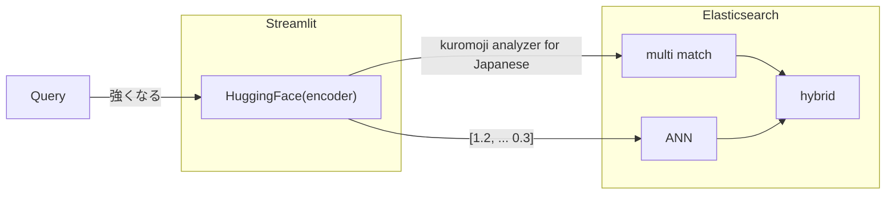

# Doraemon Himitsu Dogu Japanese semantic search

Python based Doraemon Himitsu Dogu Japanese semantic search based on Elasticsearch approximate nearest neighbor(ANN) feature.

Japanese: Elasticsearch の近似近傍探索機能を使ったドラえもんのひみつ道具自然言語検索エンジン


## Key technology

- HuggingFace
  - [sonoisa/sentence-bert-base-ja-mean-tokens-v2](https://huggingface.co/sonoisa/sentence-bert-base-ja-mean-tokens-v2)
- Elasticsearch
- Streamlit

## Dataset

I made a Himitdu Dogu dataset based on this site.
[ひみつ道具カタログ](https://www.tv-asahi.co.jp/doraemon/tool/a.html)

## Indexing phase


## Search phase



## How to set up

```bash
# Do in background...
$ make run-es
make run-es
es01
[+] Building 0.1s (6/6) FINISHED
 => [internal] load build definition from Dockerfile                                                                                                                           0.0s
 => => transferring dockerfile: 223B
...

$ make build-index
Get the certification for ElasticSearch
Make structured data from raw data
poetry run python doraemon_himitsu_dogu_search/preprocess.py
Run sentence vectorizer
poetry run python doraemon_himitsu_dogu_search/sentence_bert_vectorizer.py
Start BERT encode
100%|█████████████████████████████████████████████████████████████████████████████████████████████████████████████████████████████| 41/41 [03:02<00:00,  4.45s/it]
End BERT encode
Start serialization as numpy file
End serialization
Run Elasticsearch indexing job
poetry run python doraemon_himitsu_dogu_search/indexer.py

$ make run-app
Get the certification for ElasticSearch
Running the web app for Doraemon himitsu dogu search
poetry run streamlit run doraemon_himitsu_dogu_search/app.py

  You can now view your Streamlit app in your browser.

  Local URL: http://localhost:8501
```


## Related Posts

- [Elasticsearchの近似近傍探索を使って、ドラえもんのひみつ道具検索エンジンを作ってみた \| 🦅 hurutoriya](https://shunyaueta.com/posts/2022-10-23-2344/) in Japanese
- [Elasticsearch 8\.4 から利用可能な従来の検索機能と近似近傍探索を組み合わせたハイブリッド検索を試す \| 🦅 hurutoriya](https://shunyaueta.com/posts/2022-10-29-2337/) in Japanese

----

## メモ (2022-11-03, morioka) (2023-01-30更新)

- 勤務先で確認しようとすると、またいくつものproxy ... apt, java, elasticsearch, pip, .... が課題になる。
- 事前確認として、自宅 Ubuntu20.04/WSL2 で作業した内容を以下に示す。  
  - (2022-11-03) Lenovo ThinkPad E495, RAM 32GB, GPU なし, Windows10 Home + WSL2 + Ubuntu20.04
  - (2023-01-30) Lenovo Legion T5 26IAB7 , RAM 80GB, GPU RTX3060-12G, Windows11 Home + WSL2 + Ubuntu22.04
- 動作させるにはいくつか修正が必要だった。

### `make run-es` 関連の不具合
- `es01`がないとエラー
  - 原因: コンテナ `es01` を作り直すためにいったん削除するが、初回は存在しないのでエラー
  - 対策: `docker rm` でなく `docker rm -f` を利用する
    -  `@docker rm -f es01` 
- network elastic が見つからないとエラー
  - 原因: ネットワーク `elastic` がないのに、それを利用しようとしている
  - 対策: 指定しない。デフォルトの無名のブリッジ接続で利用する
  - 別案: 該当のネットワークを作成してもよい
- コンテナ起動時にエラー
  - 原因: メモリ割り当て量が不足
  - 対策: メモリ割り当てを増やす
    - [docker起動時にエラー「[1]: max virtual memory areas vm.max_map_count [65530] is too low, increase to at least [262144]」が発生した場合の対処法 | mebee](https://mebee.info/2020/04/13/post-9135/)
    - `sudo sysctl -w vm.max_map_count=262144`

### `make build-index` 関連の不具合
- poetry環境の用意
  - これが一番の難点だった。自分が pyenv + pyenv-virtualenv 環境を常用しているせいと、ubuntu20.04標準ではpython 3.8だが、今回はpython 3.10を必要とするせいだろう、巷の記事とは異なる挙動を示していた。
  - 最終的には pyenv + pyenv-virtualenv で作成したpython仮想環境で poetry を利用する形で動作した。これがベストかはわからない。以下にそのまま示す。別のコンテナ環境に追い出すのが素直だったかもしれない。
```bash
cd doraemon-himitsu-dogu-search
pyenv install 3.10.8
pyenv virtualenv 3.10.8 doraemon-himitsu-dogu-search
# 管理を楽にするため、仮想環境名をディレクトリ名に合わせた
pyenv local doraemon-himitsu-dogu-search
pyenv shell doraemon-himitsu-dogu-search
# pyenv local だけでは、poetryが3.10.8を見てくれなかった。
pip install poetry
# 推奨されないかたちで poetry をインストール
poetry install
# poetry で、必要なパッケージと依存関係をインストール
```
- `poetry run pyhton $(SRC)/sentence_bert_vectorizer.py` で OOM エラー
  - 原因: CPUメモリ不足 (32GB RAMの場合)
  - 対策: encode を複数回に分けるようコード修正
    - これでも make から呼び出した場合などはメモリ不足に陥る。indexerを実行するまでは es を起動せずに 1ステップずつ実行するのがよさそうである。
  - 対策2: 実際には加工済のデータが置かれている。これをそのまま使える。
    - `data/output/himitsu_dogu_sentens_vector.npy` 
- `poetry run pyhton $(SRC)/sentence_bert_vectorizer.py` で CUDA out of memory
  - 原因: RTX3060-12G では不足
  - 対策1: GPUを使わずCPUで対応する。 `export CUDA_VISIBLE_DEVICES=`
  - 対策2: bertでエンコードする際の分割数を変更する。 `n=320` -> `n=160`

### その他 (2022-11-03)

- コンテナ `es01` にはボリューム `-v /usr/share/elasticsearch/data` が指定されている。指定方法からわかるように、このボリュームは揮発性である。

### その他 (2023-01-30)

- elasticsarch 8.4 から elasticsearch 8.6 にアップデート。client API変更に追従した。
- analyzer に [elasticsearch-sudachi](https://github.com/WorksApplications/elasticsearch-sudachi) を指定できるよう修正した。


### その他 (2023-01-31)

- [ElasticsearchのIngest Pipelineでtext embeddingを埋め込む & サクッとKNN+BM25のHybrid Searchを試せるリポジトリを作った - ときどき起きる](https://hit-the-sack.hatenablog.com/entry/TestingHybridSearchWithElasticsearch)にならって、ハイブリッド検索での重みづけ指定UIを追加。
  - [pakio/EsBM25SemanticHybridComparison: (Demo) Elasticsearch with ML node and ingest pipeline for hybrid search (Lexical + Semantic)](https://github.com/pakio/EsBM25SemanticHybridComparison)
- 近似近傍探索の類似度尺度をL2距離からコサイン類似度に変更。
- `sentens`, `sentents` など `sentence` の typo 修正

### その他 (2023-02-01)

- elasticsearch起動時のGeoIPデータのダウンロードを抑制
- sudachi system_full.dic を system_core.dic に読み替え
- sudachi pos_filter, word_filterを追加。助動詞などストップワードの扱い。 [Elasticsearch NEXT STEP](https://news.nextpublishing.jp/news/detail/128/)(ISBN 978-4- 8443-9898-1)に倣う。
